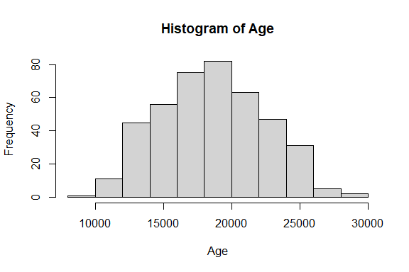
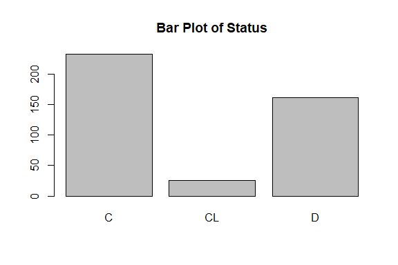
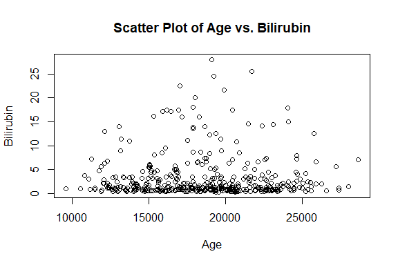
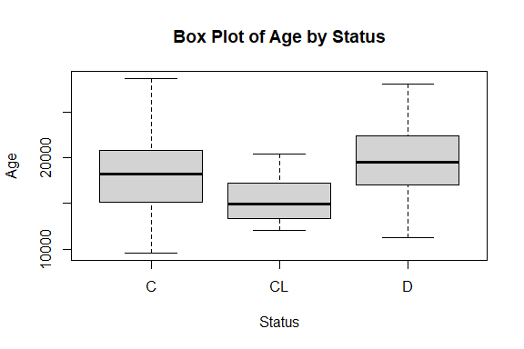

Cirrhosis Prediction
================
Trevor Okinda
2024

- [Student Details](#student-details)
- [Setup Chunk](#setup-chunk)
  - [Source:](#source)
  - [Reference:](#reference)
- [Exploratory Data Analysis](#exploratory-data-analysis)
  - [Load dataset](#load-dataset)
  - [Measures of Frequency](#measures-of-frequency)
  - [Measures of Central Tendency](#measures-of-central-tendency)
  - [Measures of Distribution](#measures-of-distribution)
  - [Measures of Relationship](#measures-of-relationship)
  - [ANOVA](#anova)
  - [Plots](#plots)
- [Preprocessing and Data
  Transformation](#preprocessing-and-data-transformation)
  - [Missing Values](#missing-values)
  - [Clean Dataset](#clean-dataset)
- [Training Model](#training-model)
  - [Data Splitting](#data-splitting)
  - [Bootstrapping](#bootstrapping)
  - [Cross-validation](#cross-validation)
  - [Training Different Models](#training-different-models)
  - [Performance Comparison](#performance-comparison)
  - [Saving Model](#saving-model)

# Student Details

|                       |                      |
|-----------------------|----------------------|
| **Student ID Number** | 134780               |
| **Student Name**      | Trevor Okinda        |
| **BBIT 4.2 Group**    | C                    |
| **Project Name**      | Cirrhosis Prediction |

# Setup Chunk

**Note:** the following KnitR options have been set as the global
defaults: <BR>
`knitr::opts_chunk$set(echo = TRUE, warning = FALSE, eval = TRUE, collapse = FALSE, tidy = TRUE)`.

More KnitR options are documented here
<https://bookdown.org/yihui/rmarkdown-cookbook/chunk-options.html> and
here <https://yihui.org/knitr/options/>.

### Source:

The dataset that was used can be downloaded here: *\<<a
href="https://www.kaggle.com/datasets/fedesoriano/cirrhosis-prediction-dataset\"
class="uri">https://www.kaggle.com/datasets/fedesoriano/cirrhosis-prediction-dataset\</a>\>*

### Reference:

*\<fedesoriano. (August 2021). Cirrhosis Prediction Dataset. Retrieved
\[Date Retrieved\] from <a
href="https://www.kaggle.com/fedesoriano/cirrhosis-prediction-dataset.\"
class="uri">https://www.kaggle.com/fedesoriano/cirrhosis-prediction-dataset.\</a>\>  
Refer to the APA 7th edition manual for rules on how to cite datasets:
<https://apastyle.apa.org/style-grammar-guidelines/references/examples/data-set-references>*

# Exploratory Data Analysis

## Load dataset

``` r
# Load dataset
liver_data <- read.csv("cirrhosis.csv", colClasses = c(
  N_Days = "numeric",
  Status = "factor",
  Drug = "factor",
  Age = "numeric",
  Sex = "factor",
  Ascites = "factor",
  Hepatomegaly = "factor",
  Spiders = "factor",
  Edema = "factor",
  Bilirubin = "numeric",
  Cholesterol = "numeric",
  Albumin = "numeric",
  Copper = "numeric",
  Alk_Phos = "numeric",
  SGOT = "numeric",
  Tryglicerides = "numeric",
  Platelets = "numeric",
  Prothrombin = "numeric",
  Stage = "factor"
))

# Display the structure of the dataset
str(liver_data)
```

    ## 'data.frame':    418 obs. of  19 variables:
    ##  $ N_Days       : num  400 4500 1012 1925 1504 ...
    ##  $ Status       : Factor w/ 3 levels "C","CL","D": 3 1 3 3 2 3 1 3 3 3 ...
    ##  $ Drug         : Factor w/ 3 levels "","D-penicillamine",..: 2 2 2 2 3 3 3 3 2 3 ...
    ##  $ Age          : num  21464 20617 25594 19994 13918 ...
    ##  $ Sex          : Factor w/ 2 levels "F","M": 1 1 2 1 1 1 1 1 1 1 ...
    ##  $ Ascites      : Factor w/ 3 levels "","N","Y": 3 2 2 2 2 2 2 2 2 3 ...
    ##  $ Hepatomegaly : Factor w/ 3 levels "","N","Y": 3 3 2 3 3 3 3 2 2 2 ...
    ##  $ Spiders      : Factor w/ 3 levels "","N","Y": 3 3 2 3 3 2 2 2 3 3 ...
    ##  $ Edema        : Factor w/ 3 levels "N","S","Y": 3 1 2 2 1 1 1 1 1 3 ...
    ##  $ Bilirubin    : num  14.5 1.1 1.4 1.8 3.4 0.8 1 0.3 3.2 12.6 ...
    ##  $ Cholesterol  : num  261 302 176 244 279 248 322 280 562 200 ...
    ##  $ Albumin      : num  2.6 4.14 3.48 2.54 3.53 3.98 4.09 4 3.08 2.74 ...
    ##  $ Copper       : num  156 54 210 64 143 50 52 52 79 140 ...
    ##  $ Alk_Phos     : num  1718 7395 516 6122 671 ...
    ##  $ SGOT         : num  137.9 113.5 96.1 60.6 113.2 ...
    ##  $ Tryglicerides: num  172 88 55 92 72 63 213 189 88 143 ...
    ##  $ Platelets    : num  190 221 151 183 136 NA 204 373 251 302 ...
    ##  $ Prothrombin  : num  12.2 10.6 12 10.3 10.9 11 9.7 11 11 11.5 ...
    ##  $ Stage        : Factor w/ 5 levels "","1","2","3",..: 5 4 5 5 4 4 4 4 3 5 ...

``` r
# View the first few rows of the dataset
head(liver_data)
```

    ##   N_Days Status            Drug   Age Sex Ascites Hepatomegaly Spiders Edema
    ## 1    400      D D-penicillamine 21464   F       Y            Y       Y     Y
    ## 2   4500      C D-penicillamine 20617   F       N            Y       Y     N
    ## 3   1012      D D-penicillamine 25594   M       N            N       N     S
    ## 4   1925      D D-penicillamine 19994   F       N            Y       Y     S
    ## 5   1504     CL         Placebo 13918   F       N            Y       Y     N
    ## 6   2503      D         Placebo 24201   F       N            Y       N     N
    ##   Bilirubin Cholesterol Albumin Copper Alk_Phos   SGOT Tryglicerides Platelets
    ## 1      14.5         261    2.60    156   1718.0 137.95           172       190
    ## 2       1.1         302    4.14     54   7394.8 113.52            88       221
    ## 3       1.4         176    3.48    210    516.0  96.10            55       151
    ## 4       1.8         244    2.54     64   6121.8  60.63            92       183
    ## 5       3.4         279    3.53    143    671.0 113.15            72       136
    ## 6       0.8         248    3.98     50    944.0  93.00            63        NA
    ##   Prothrombin Stage
    ## 1        12.2     4
    ## 2        10.6     3
    ## 3        12.0     4
    ## 4        10.3     4
    ## 5        10.9     3
    ## 6        11.0     3

``` r
# View the dataset in a separate viewer window
View(liver_data)
```

## Measures of Frequency

``` r
# Frequency of categorical variables
table(liver_data$Status)
```

    ## 
    ##   C  CL   D 
    ## 232  25 161

``` r
table(liver_data$Drug)
```

    ## 
    ##                 D-penicillamine         Placebo 
    ##             106             158             154

``` r
table(liver_data$Sex)
```

    ## 
    ##   F   M 
    ## 374  44

``` r
table(liver_data$Ascites)
```

    ## 
    ##       N   Y 
    ## 106 288  24

``` r
table(liver_data$Hepatomegaly)
```

    ## 
    ##       N   Y 
    ## 106 152 160

``` r
table(liver_data$Spiders)
```

    ## 
    ##       N   Y 
    ## 106 222  90

``` r
table(liver_data$Edema)
```

    ## 
    ##   N   S   Y 
    ## 354  44  20

``` r
table(liver_data$Stage)
```

    ## 
    ##       1   2   3   4 
    ##   6  21  92 155 144

## Measures of Central Tendency

``` r
# Mean, median, and mode for numerical variables
mean(liver_data$Age)
```

    ## [1] 18533.35

``` r
median(liver_data$Age)
```

    ## [1] 18628

``` r
Mode <- function(x) {
  ux <- unique(x)
  ux[which.max(tabulate(match(x, ux)))]
}
Mode(liver_data$Age)
```

    ## [1] 19724

``` r
mean(liver_data$Bilirubin)
```

    ## [1] 3.220813

``` r
median(liver_data$Bilirubin)
```

    ## [1] 1.4

``` r
Mode(liver_data$Bilirubin)
```

    ## [1] 0.7

## Measures of Distribution

``` r
# Range for numerical variables
range(liver_data$Age)
```

    ## [1]  9598 28650

``` r
range(liver_data$Bilirubin)
```

    ## [1]  0.3 28.0

``` r
# Variance and standard deviation
var(liver_data$Age)
```

    ## [1] 14560673

``` r
sd(liver_data$Age)
```

    ## [1] 3815.845

``` r
var(liver_data$Bilirubin)
```

    ## [1] 19.42611

``` r
sd(liver_data$Bilirubin)
```

    ## [1] 4.407506

``` r
# Quartiles
quantile(liver_data$Age)
```

    ##      0%     25%     50%     75%    100% 
    ##  9598.0 15644.5 18628.0 21272.5 28650.0

``` r
quantile(liver_data$Bilirubin)
```

    ##   0%  25%  50%  75% 100% 
    ##  0.3  0.8  1.4  3.4 28.0

## Measures of Relationship

``` r
# Correlation matrix
cor_matrix <- cor(liver_data[, c("Age", "Bilirubin", "Cholesterol", "Albumin", "Copper", "Alk_Phos", "SGOT", "Tryglicerides", "Platelets", "Prothrombin")])
print(cor_matrix)
```

    ##                       Age   Bilirubin Cholesterol    Albumin Copper Alk_Phos
    ## Age            1.00000000  0.00236189          NA -0.1823500     NA       NA
    ## Bilirubin      0.00236189  1.00000000          NA -0.3141771     NA       NA
    ## Cholesterol            NA          NA           1         NA     NA       NA
    ## Albumin       -0.18234998 -0.31417711          NA  1.0000000     NA       NA
    ## Copper                 NA          NA          NA         NA      1       NA
    ## Alk_Phos               NA          NA          NA         NA     NA        1
    ## SGOT                   NA          NA          NA         NA     NA       NA
    ## Tryglicerides          NA          NA          NA         NA     NA       NA
    ## Platelets              NA          NA          NA         NA     NA       NA
    ## Prothrombin            NA          NA          NA         NA     NA       NA
    ##               SGOT Tryglicerides Platelets Prothrombin
    ## Age             NA            NA        NA          NA
    ## Bilirubin       NA            NA        NA          NA
    ## Cholesterol     NA            NA        NA          NA
    ## Albumin         NA            NA        NA          NA
    ## Copper          NA            NA        NA          NA
    ## Alk_Phos        NA            NA        NA          NA
    ## SGOT             1            NA        NA          NA
    ## Tryglicerides   NA             1        NA          NA
    ## Platelets       NA            NA         1          NA
    ## Prothrombin     NA            NA        NA           1

## ANOVA

``` r
# One-Way ANOVA example (e.g., comparing Age across different Status)
anova_age <- aov(Age ~ Status, data = liver_data)
summary(anova_age)
```

    ##              Df    Sum Sq   Mean Sq F value   Pr(>F)    
    ## Status        2 5.371e+08 268525595   20.13 4.51e-09 ***
    ## Residuals   415 5.535e+09  13336746                     
    ## ---
    ## Signif. codes:  0 '***' 0.001 '**' 0.01 '*' 0.05 '.' 0.1 ' ' 1

``` r
# Two-Way ANOVA example (e.g., comparing Age across Sex and Drug)
anova_age_sex_drug <- aov(Age ~ Sex + Drug, data = liver_data)
summary(anova_age_sex_drug)
```

    ##              Df    Sum Sq   Mean Sq F value   Pr(>F)    
    ## Sex           1 1.620e+08 161996437  11.689 0.000691 ***
    ## Drug          2 1.720e+08  86019599   6.207 0.002209 ** 
    ## Residuals   414 5.738e+09  13859336                     
    ## ---
    ## Signif. codes:  0 '***' 0.001 '**' 0.01 '*' 0.05 '.' 0.1 ' ' 1

## Plots

``` r
# Histogram for Age
hist(liver_data$Age, main = "Histogram of Age", xlab = "Age")
```

<!-- -->

``` r
# Bar plot for Status
barplot(table(liver_data$Status), main = "Bar Plot of Status")
```

<!-- -->

``` r
# Scatter plot for Age vs. Bilirubin
plot(liver_data$Age, liver_data$Bilirubin, main = "Scatter Plot of Age vs. Bilirubin", 
     xlab = "Age", ylab = "Bilirubin")
```

<!-- -->

``` r
# Box plot for Age by Status
boxplot(Age ~ Status, data = liver_data, main = "Box Plot of Age by Status", 
        xlab = "Status", ylab = "Age")
```

<!-- -->

# Preprocessing and Data Transformation

## Missing Values

``` r
# Check for missing values in the dataset
missing_values <- colSums(is.na(liver_data))

# Print columns with missing values
print(missing_values[missing_values > 0])
```

    ##   Cholesterol        Copper      Alk_Phos          SGOT Tryglicerides 
    ##           134           108           106           106           136 
    ##     Platelets   Prothrombin 
    ##            11             2

## Clean Dataset

``` r
# Delete rows with missing values
cleaned_liver_data <- na.omit(liver_data)

# Check the dimensions of the cleaned dataset
dim(cleaned_liver_data)
```

    ## [1] 276  19

``` r
# Check for missing values in the cleaned dataset
missing_values_cleaned <- colSums(is.na(cleaned_liver_data))

# Print columns with missing values (if any)
print(missing_values_cleaned[missing_values_cleaned > 0])
```

    ## named numeric(0)

# Training Model

## Data Splitting

``` r
# Set seed for reproducibility
set.seed(123)

# Split data into training and testing sets (e.g., 80% train, 20% test)
train_indices <- sample(1:nrow(cleaned_liver_data), 0.8*nrow(cleaned_liver_data))
train_data <- cleaned_liver_data[train_indices, ]
test_data <- cleaned_liver_data[-train_indices, ]

dim(train_data)
```

    ## [1] 220  19

``` r
dim(test_data)
```

    ## [1] 56 19

## Bootstrapping

``` r
# Perform bootstrapping on Cholesterol
bootstrap_chol <- function(data, num_bootstraps) {
  bootstrap_means <- numeric(num_bootstraps)
  for (i in 1:num_bootstraps) {
    bootstrap_sample <- sample(data$Cholesterol, replace = TRUE)
    bootstrap_means[i] <- mean(bootstrap_sample)
  }
  return(bootstrap_means)
}

# Number of bootstraps
num_bootstraps <- 1000

# Run bootstrapping
bootstrap_means_chol <- bootstrap_chol(cleaned_liver_data, num_bootstraps)

# Summary of bootstrapped means
summary(bootstrap_means_chol)
```

    ##    Min. 1st Qu.  Median    Mean 3rd Qu.    Max. 
    ##   335.2   361.0   370.5   370.9   380.1   423.0

## Cross-validation

``` r
# Example using basic k-fold cross-validation with logistic regression
library(caret)
```

    ## Loading required package: ggplot2

    ## Loading required package: lattice

``` r
# Define control parameters for cross-validation
control <- trainControl(method = "cv", number = 5)


# Train logistic regression model using cross-validation
model <- train(Status ~ ., data = train_data, method = "rf", trControl = control)

# Print model performance
print(model)
```

    ## Random Forest 
    ## 
    ## 220 samples
    ##  18 predictor
    ##   3 classes: 'C', 'CL', 'D' 
    ## 
    ## No pre-processing
    ## Resampling: Cross-Validated (5 fold) 
    ## Summary of sample sizes: 176, 177, 175, 175, 177 
    ## Resampling results across tuning parameters:
    ## 
    ##   mtry  Accuracy   Kappa    
    ##    2    0.7279915  0.4831754
    ##   14    0.7136293  0.4607331
    ##   26    0.7410171  0.5101383
    ## 
    ## Accuracy was used to select the optimal model using the largest value.
    ## The final value used for the model was mtry = 26.

## Training Different Models

``` r
# Train multinomial logistic regression model
library(nnet)
model_multinom <- multinom(Status ~ ., data = train_data)
```

    ## # weights:  84 (54 variable)
    ## initial  value 241.694704 
    ## iter  10 value 162.799430
    ## iter  20 value 152.607728
    ## iter  30 value 113.298166
    ## iter  40 value 108.360461
    ## iter  50 value 108.040700
    ## iter  60 value 108.010769
    ## iter  70 value 108.007875
    ## final  value 108.007845 
    ## converged

``` r
# Print model summary
summary(model_multinom)
```

    ## Call:
    ## multinom(formula = Status ~ ., data = train_data)
    ## 
    ## Coefficients:
    ##    (Intercept)        N_Days DrugD-penicillamine DrugPlacebo           Age
    ## CL   -2.202985 -0.0011464898          -0.7086603   -1.494324 -2.805961e-04
    ## D    -5.271567 -0.0006402255          -2.3323864   -2.939181  9.495596e-05
    ##        SexM  AscitesN  AscitesY HepatomegalyN HepatomegalyY  SpidersN  SpidersY
    ## CL 2.220497  5.259262 -7.462246     -2.272433    0.06944871 -1.015378 -1.187607
    ## D  1.826786 -3.102279 -2.169288     -2.821006   -2.45056082 -2.920905 -2.350662
    ##        EdemaS      EdemaY  Bilirubin Cholesterol   Albumin       Copper
    ## CL  1.3150818 -14.4989613 0.08440865 0.002733456 0.4427605  0.004037731
    ## D  -0.2381992   0.4561592 0.28370474 0.002091386 0.5898222 -0.000933742
    ##         Alk_Phos        SGOT Tryglicerides   Platelets Prothrombin    Stage1
    ## CL -0.0005226099 0.002236214 -0.0040474817 0.006523761  -0.2368686 -9.613857
    ## D   0.0004202113 0.002029432  0.0000954523 0.002676126   0.9767014 -4.318218
    ##       Stage2      Stage3     Stage4
    ## CL  1.064586  2.95182980  3.3944568
    ## D  -0.562622 -0.06405116 -0.3266754
    ## 
    ## Std. Errors:
    ##     (Intercept)       N_Days DrugD-penicillamine  DrugPlacebo          Age
    ## CL 6.762066e-06 0.0004084289        1.538220e-05 2.168966e-05 6.632220e-05
    ## D  4.160070e-06 0.0001997348        1.251395e-05 1.340702e-05 3.748686e-05
    ##            SexM     AscitesN     AscitesY HepatomegalyN HepatomegalyY
    ## CL 9.577743e-06 6.762061e-06 7.528194e-12  8.640915e-06  6.369984e-06
    ## D  5.545413e-06 4.881288e-06 1.214010e-06  1.076003e-05  1.022489e-05
    ##        SpidersN     SpidersY       EdemaS       EdemaY    Bilirubin Cholesterol
    ## CL 1.132577e-05 8.272267e-06 8.967437e-06 1.544466e-12 6.393203e-05 0.001777337
    ## D  1.063124e-05 1.103119e-05 7.667303e-06 2.907621e-06 3.990787e-05 0.001411436
    ##         Albumin      Copper     Alk_Phos        SGOT Tryglicerides   Platelets
    ## CL 2.743268e-05 0.004708085 0.0005080305 0.006434731   0.006176977 0.003550685
    ## D  1.534333e-05 0.003136328 0.0001223152 0.003770770   0.003760075 0.002121437
    ##     Prothrombin       Stage1       Stage2       Stage3       Stage4
    ## CL 7.155148e-05 1.101927e-11 7.354350e-06 7.987327e-06 7.114720e-06
    ## D  5.617896e-05 2.497509e-06 7.758921e-06 1.816864e-05 1.116543e-05
    ## 
    ## Residual Deviance: 216.0157 
    ## AIC: 304.0157

``` r
# Make predictions on the test set
predictions_multinom <- predict(model_multinom, newdata = test_data)

# Evaluate model performance
confusionMatrix(predictions_multinom, test_data$Status)
```

    ## Confusion Matrix and Statistics
    ## 
    ##           Reference
    ## Prediction  C CL  D
    ##         C  27  2  7
    ##         CL  2  0  1
    ##         D   5  0 12
    ## 
    ## Overall Statistics
    ##                                          
    ##                Accuracy : 0.6964         
    ##                  95% CI : (0.559, 0.8122)
    ##     No Information Rate : 0.6071         
    ##     P-Value [Acc > NIR] : 0.1079         
    ##                                          
    ##                   Kappa : 0.3921         
    ##                                          
    ##  Mcnemar's Test P-Value : 0.7212         
    ## 
    ## Statistics by Class:
    ## 
    ##                      Class: C Class: CL Class: D
    ## Sensitivity            0.7941   0.00000   0.6000
    ## Specificity            0.5909   0.94444   0.8611
    ## Pos Pred Value         0.7500   0.00000   0.7059
    ## Neg Pred Value         0.6500   0.96226   0.7949
    ## Prevalence             0.6071   0.03571   0.3571
    ## Detection Rate         0.4821   0.00000   0.2143
    ## Detection Prevalence   0.6429   0.05357   0.3036
    ## Balanced Accuracy      0.6925   0.47222   0.7306

``` r
# Train random forest model
library(randomForest)
```

    ## randomForest 4.7-1.1

    ## Type rfNews() to see new features/changes/bug fixes.

    ## 
    ## Attaching package: 'randomForest'

    ## The following object is masked from 'package:ggplot2':
    ## 
    ##     margin

``` r
model_rf <- randomForest(Status ~ ., data = train_data)

# Print model summary
print(model_rf)
```

    ## 
    ## Call:
    ##  randomForest(formula = Status ~ ., data = train_data) 
    ##                Type of random forest: classification
    ##                      Number of trees: 500
    ## No. of variables tried at each split: 4
    ## 
    ##         OOB estimate of  error rate: 26.36%
    ## Confusion matrix:
    ##     C CL  D class.error
    ## C  95  0 18   0.1592920
    ## CL  4  0 12   1.0000000
    ## D  24  0 67   0.2637363

``` r
# Make predictions on the test set
predictions_rf <- predict(model_rf, newdata = test_data)

# Evaluate model performance
confusionMatrix(predictions_rf, test_data$Status)
```

    ## Confusion Matrix and Statistics
    ## 
    ##           Reference
    ## Prediction  C CL  D
    ##         C  29  2  6
    ##         CL  0  0  0
    ##         D   5  0 14
    ## 
    ## Overall Statistics
    ##                                           
    ##                Accuracy : 0.7679          
    ##                  95% CI : (0.6358, 0.8702)
    ##     No Information Rate : 0.6071          
    ##     P-Value [Acc > NIR] : 0.008415        
    ##                                           
    ##                   Kappa : 0.514           
    ##                                           
    ##  Mcnemar's Test P-Value : NA              
    ## 
    ## Statistics by Class:
    ## 
    ##                      Class: C Class: CL Class: D
    ## Sensitivity            0.8529   0.00000   0.7000
    ## Specificity            0.6364   1.00000   0.8611
    ## Pos Pred Value         0.7838       NaN   0.7368
    ## Neg Pred Value         0.7368   0.96429   0.8378
    ## Prevalence             0.6071   0.03571   0.3571
    ## Detection Rate         0.5179   0.00000   0.2500
    ## Detection Prevalence   0.6607   0.00000   0.3393
    ## Balanced Accuracy      0.7447   0.50000   0.7806

``` r
# Train SVM model
library(e1071)
model_svm <- svm(Status ~ ., data = train_data)

# Print model summary
print(model_svm)
```

    ## 
    ## Call:
    ## svm(formula = Status ~ ., data = train_data)
    ## 
    ## 
    ## Parameters:
    ##    SVM-Type:  C-classification 
    ##  SVM-Kernel:  radial 
    ##        cost:  1 
    ## 
    ## Number of Support Vectors:  144

``` r
# Make predictions on the test set
predictions_svm <- predict(model_svm, newdata = test_data)

# Evaluate model performance
confusionMatrix(predictions_svm, test_data$Status)
```

    ## Confusion Matrix and Statistics
    ## 
    ##           Reference
    ## Prediction  C CL  D
    ##         C  29  2  8
    ##         CL  0  0  0
    ##         D   5  0 12
    ## 
    ## Overall Statistics
    ##                                          
    ##                Accuracy : 0.7321         
    ##                  95% CI : (0.597, 0.8417)
    ##     No Information Rate : 0.6071         
    ##     P-Value [Acc > NIR] : 0.03535        
    ##                                          
    ##                   Kappa : 0.4286         
    ##                                          
    ##  Mcnemar's Test P-Value : NA             
    ## 
    ## Statistics by Class:
    ## 
    ##                      Class: C Class: CL Class: D
    ## Sensitivity            0.8529   0.00000   0.6000
    ## Specificity            0.5455   1.00000   0.8611
    ## Pos Pred Value         0.7436       NaN   0.7059
    ## Neg Pred Value         0.7059   0.96429   0.7949
    ## Prevalence             0.6071   0.03571   0.3571
    ## Detection Rate         0.5179   0.00000   0.2143
    ## Detection Prevalence   0.6964   0.00000   0.3036
    ## Balanced Accuracy      0.6992   0.50000   0.7306

## Performance Comparison

``` r
# Load necessary libraries
library(caret)
library(e1071)  # For SVM
library(nnet)  # For neural networks
library(randomForest)  # For random forest

# Define control for cross-validation
control <- trainControl(method = "cv", number = 10)

# Train SVM model
set.seed(123)  # For reproducibility
model_svm <- train(Status ~ ., data = train_data, method = "svmRadial", trControl = control)

# Train neural network (nnet) model
set.seed(123)
model_nnet <- train(Status ~ ., data = train_data, method = "nnet", trControl = control, trace = FALSE, linout = TRUE)

# Train multinomial logistic regression model
set.seed(123)
model_multinom <- train(Status ~ ., data = train_data, method = "multinom", trControl = control, trace = FALSE)

# Train random forest model
set.seed(123)
model_rf <- train(Status ~ ., data = train_data, method = "rf", trControl = control)

# Aggregate results using resamples
results <- resamples(list(SVM = model_svm, NNet = model_nnet, Multinom = model_multinom, RF = model_rf))

# Print summary of the results
summary(results)
```

    ## 
    ## Call:
    ## summary.resamples(object = results)
    ## 
    ## Models: SVM, NNet, Multinom, RF 
    ## Number of resamples: 10 
    ## 
    ## Accuracy 
    ##               Min.   1st Qu.    Median      Mean   3rd Qu.      Max. NA's
    ## SVM      0.6363636 0.7448240 0.7727273 0.7635893 0.8095238 0.8260870    0
    ## NNet     0.5909091 0.6557971 0.7267081 0.7137117 0.7727273 0.8095238    0
    ## Multinom 0.6818182 0.7035573 0.7743271 0.7737248 0.8474026 0.8695652    0
    ## RF       0.6666667 0.6852767 0.7332016 0.7457651 0.7774327 0.8636364    0
    ## 
    ## Kappa 
    ##               Min.   1st Qu.    Median      Mean   3rd Qu.      Max. NA's
    ## SVM      0.3125000 0.5219614 0.5769231 0.5515594 0.6363430 0.6714286    0
    ## NNet     0.2265625 0.3525849 0.4715354 0.4531026 0.5694667 0.6315789    0
    ## Multinom 0.4144487 0.4705328 0.5800947 0.5858458 0.7167693 0.7561837    0
    ## RF       0.3925620 0.4373266 0.4978717 0.5293254 0.5768327 0.7564576    0

``` r
# Plot comparisons
dotplot(results)
```

<!-- -->

## Saving Model

``` r
# Load the saved SVM model
loaded_model_svm <- readRDS("./models/svm_model.rds")

# Prepare new data for prediction
new_data <- data.frame(
  N_Days = 4000,
  Age = 5000,
  Sex = "M",
  Drug = "D-penicillamine",
  Status = "C",  # You can put any placeholder value here since it's the target variable
  Ascites = "N",
  Hepatomegaly = "N",
  Spiders = "N",
  Edema = "N",
  Bilirubin = 1.2,
  Cholesterol = 150,
  Albumin = 3.5,
  Copper = 50,
  Alk_Phos = 100,
  SGOT = 40,
  Tryglicerides = 120,
  Platelets = 200,
  Prothrombin = 12,
  Stage = "1"  # You can put any placeholder value here since it's not needed for prediction
)

# Use the loaded model to make predictions for new data
predictions_loaded_model <- predict(loaded_model_svm, newdata = new_data)

# Print predictions
print(predictions_loaded_model)
```

    ## [1] C
    ## Levels: C CL D
